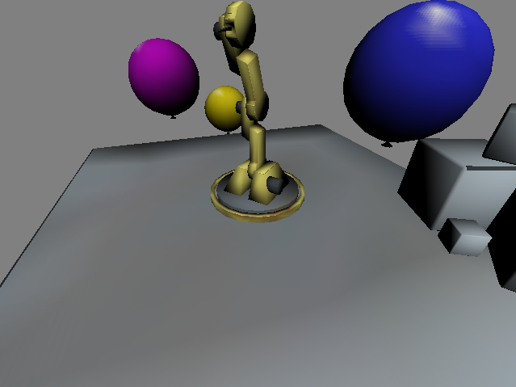
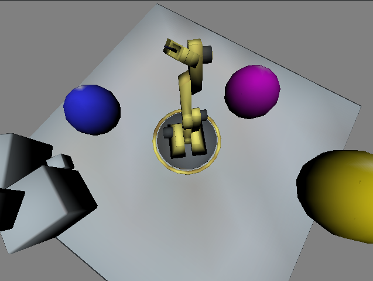

NOTE: please fill in the first section with information about your game.

# Robot Fun Police

Robot Fun Police is Rahul Balakrishnan's implementation of [*Design Document*](http://graphics.cs.cmu.edu/courses/15-466-f17/game2-designs/jmccann/) for game2 in 15-466-f17.

## Screenshots




## Pipelines

The python script export meshes located in models extracts the vertices, texture coordinates and the dimension of the object it extracts.
To create the assets in dist execute the python with blender.
The textures were manually extracted.

## Architecture

My largest investment was in textures. I feel that I really nailed the textures this time around. The code is more structured using maps to easily access data.
The movement script has been improved.

## Reflection

I expected scene to be related dynamically from the scene script. I turns out there was no implementation. I found this out too late to do anything about it. Should have started earlier.

I used multiple texture levels. That feels like an accomplishment. I have a pop mechanism built and I am sure the texture will work but have not implemented it yet.

# About Base2

This game is based on Base2, starter code for game2 in the 15-466-f17 course. It was developed by Jim McCann, and is released into the public domain.

## Requirements

 - modern C++ compiler
 - glm
 - libSDL2
 - libpng
 - blender (for mesh export script)

On Linux or OSX these requirements should be available from your package manager without too much hassle.

## Building

This code has been set up to be built with [FT jam](https://www.freetype.org/jam/).

### Getting Jam

For more information on Jam, see the [Jam Documentation](https://www.perforce.com/documentation/jam-documentation) page at Perforce, which includes both reference documentation and a getting started guide.

On unixish OSs, Jam is available from your package manager:
```
	brew install ftjam #on OSX
	apt get ftjam #on Debian-ish Linux
```

On Windows, you can get a binary [from sourceforge](https://sourceforge.net/projects/freetype/files/ftjam/2.5.2/ftjam-2.5.2-win32.zip/download),
and put it somewhere in your `%PATH%`.
(Possibly: also set the `JAM_TOOLSET` variable to `VISUALC`.)

### Bulding
Open a terminal (on windows, a Visual Studio Command Prompt), change to this directory, and type:
```
	jam
```

### Building (local libs)

Depending on your OSX, clone 
[kit-libs-linux](https://github.com/ixchow/kit-libs-linux),
[kit-libs-osx](https://github.com/ixchow/kit-libs-osx),
or [kit-libs-win](https://github.com/ixchow/kit-libs-win)
as a subdirectory of the current directory.

The Jamfile sets up library and header search paths such that local libraries will be preferred over system libraries.
