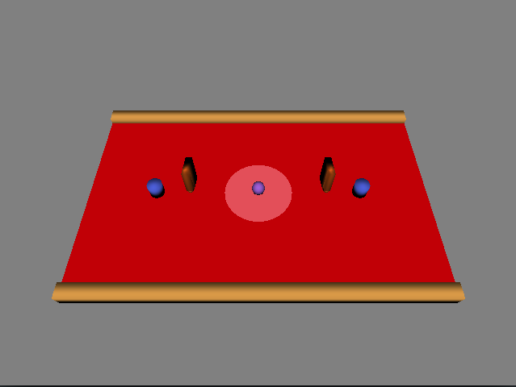

NOTE: please fill in the first section with information about your game.

# Spin

Spin is Rahul Balakrishnan's implementation of [*Design Document*](http://graphics.cs.cmu.edu/courses/15-466-f17/game3-designs/hungyuc/) for game3 in 15-466-f17.

## Screenshots




## Pipelines

The python script export meshes located in models extracts the vertices, vertex colors and the dimension of the object it extracts.
To create the assets in dist execute the python with blender.

## Architecture

Created a map to maintain the game objects.
Handled the rotation of objects in the game loop.
Triggers activate flip of the paddle.
Rudimentary friction implemented as per doc.
Physics for rotary collision was included. Some amout of friction has been programmed. Game seems fun, so far glitch free.

## Reflection

This project was finished comfortably. Unfortunately the assets were missing and I had to draw them myself.

# About Base3

This game is based on Base2, starter code for game2 in the 15-466-f17 course. It was developed by Jim McCann, and is released into the public domain.

## Requirements

 - modern C++ compiler
 - glm
 - libSDL2
 - libpng
 - blender (for mesh export script)

On Linux or OSX these requirements should be available from your package manager without too much hassle.

## Building

This code has been set up to be built with [FT jam](https://www.freetype.org/jam/).

### Getting Jam

For more information on Jam, see the [Jam Documentation](https://www.perforce.com/documentation/jam-documentation) page at Perforce, which includes both reference documentation and a getting started guide.

On unixish OSs, Jam is available from your package manager:
```
	brew install ftjam #on OSX
	apt get ftjam #on Debian-ish Linux
```

On Windows, you can get a binary [from sourceforge](https://sourceforge.net/projects/freetype/files/ftjam/2.5.2/ftjam-2.5.2-win32.zip/download),
and put it somewhere in your `%PATH%`.
(Possibly: also set the `JAM_TOOLSET` variable to `VISUALC`.)

### Bulding
Open a terminal (on windows, a Visual Studio Command Prompt), change to this directory, and type:
```
	jam
```

### Building (local libs)

Depending on your OSX, clone 
[kit-libs-linux](https://github.com/ixchow/kit-libs-linux),
[kit-libs-osx](https://github.com/ixchow/kit-libs-osx),
or [kit-libs-win](https://github.com/ixchow/kit-libs-win)
as a subdirectory of the current directory.

The Jamfile sets up library and header search paths such that local libraries will be preferred over system libraries.
